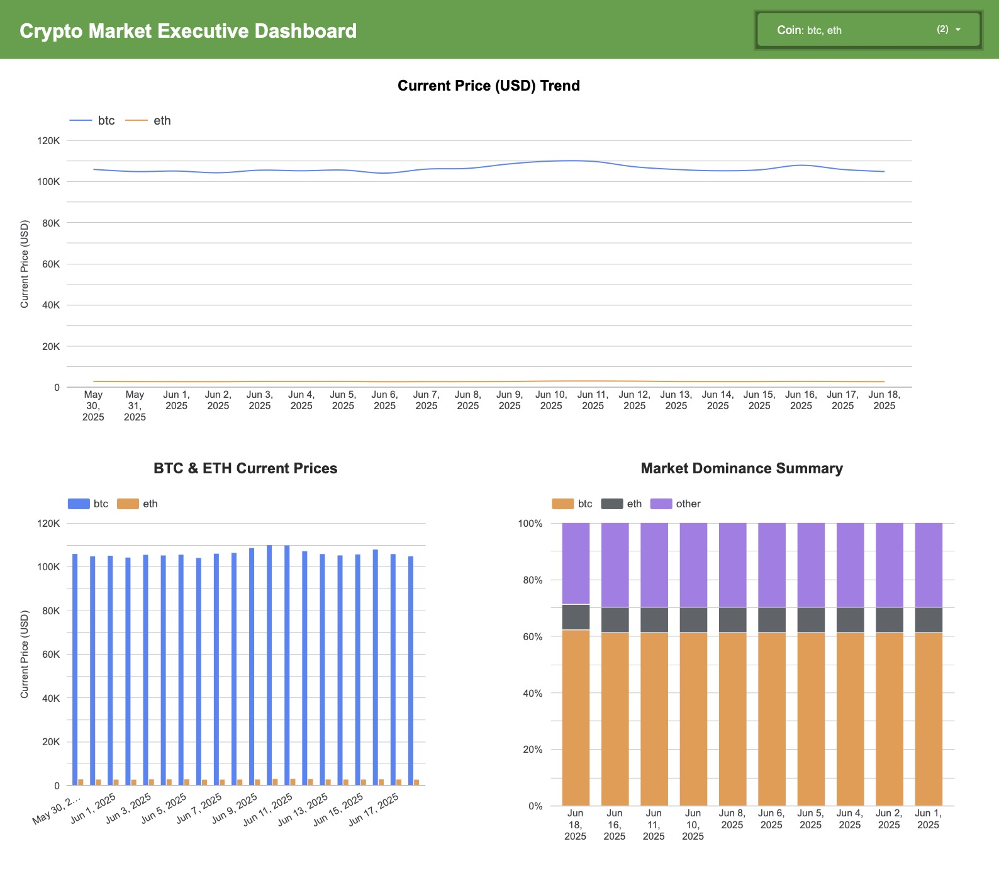
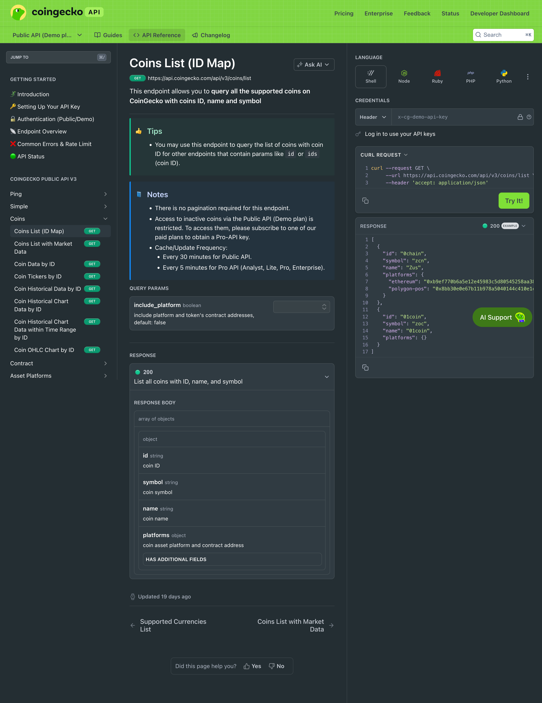
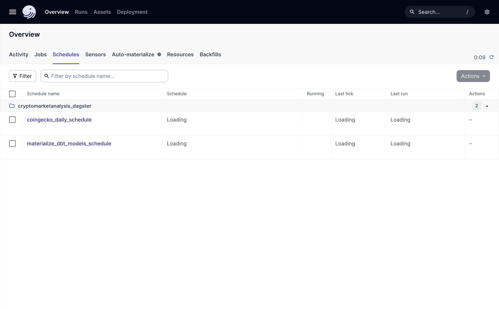
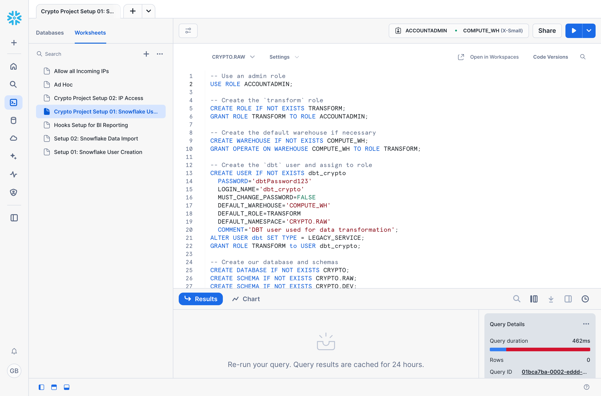
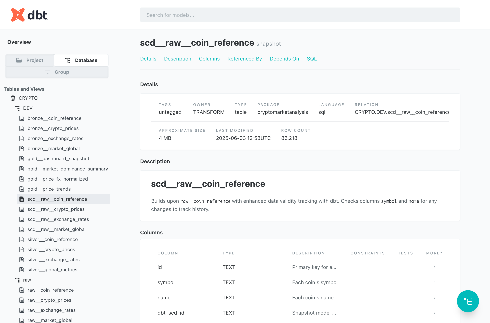
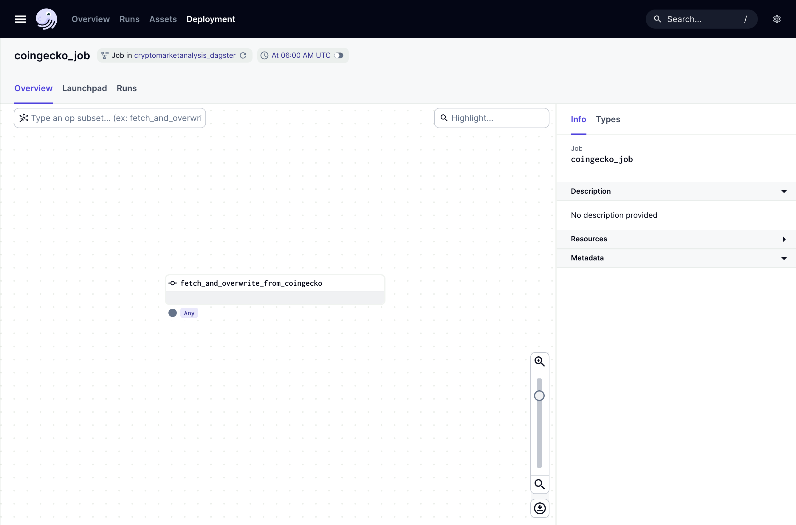
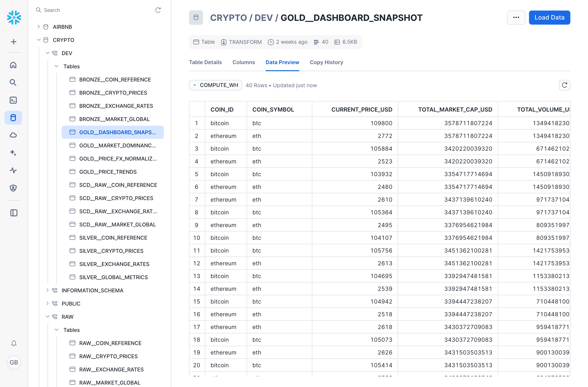
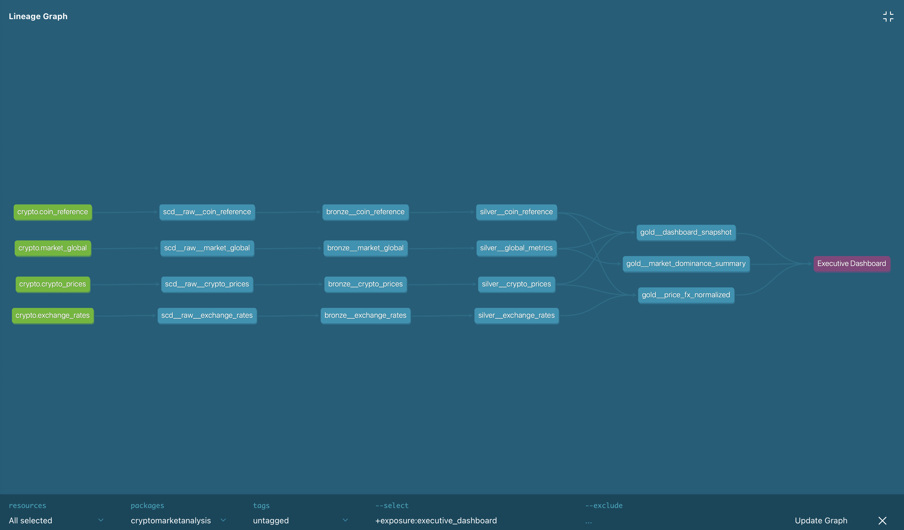
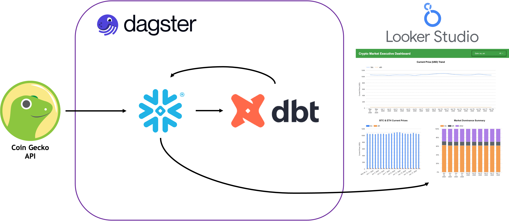
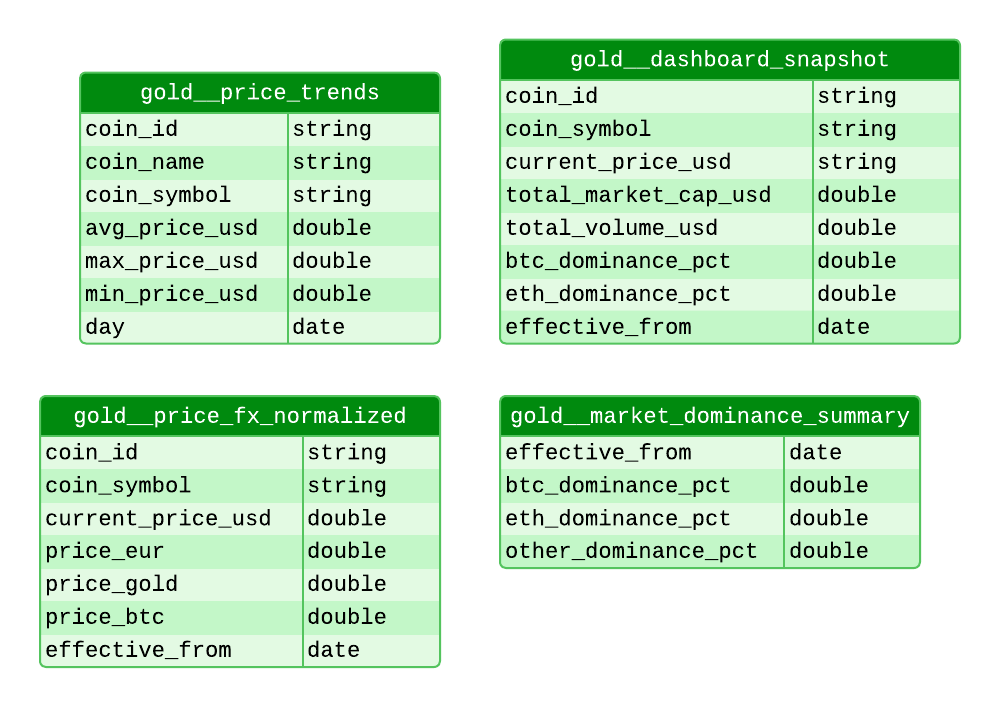

# Crypto Market Analysis

Outside of buzzwords you hear in the news and a little bit of dabbling on my part in Web3 web development, I did not know much about crypto market data and analytics - and I realized that was a great place to start with this project. Why not dive into some unfamiliar territory while building on my data and analytics engineering skills? For this one I was interested in exploring more about crypto data as a whole and discovering the meaning behind it all. What were the trends being captured? What are key cryptocurrencies to watch out for? What metrics are important to investors or anyone else outside of the financial sector? Using Coin Gecko's API was perfect for what I wanted to analyze, and this project gave me a great challenge to start using another orchestrator tool called Dagster to handle all API calls and data transformations with dbt in Snowflake, and outputting final results to a Google Looker Studio report. I learned a lot with this project!

### [Live Demo](https://lookerstudio.google.com/embed/reporting/7af6909e-3bf9-4080-b635-77f6bbdeceb9/page/yUzTF)
### [dbt Documentation](https://dbt-crypto-gdbecker.netlify.app/#!/overview)

## Project Details
- [Crypto Market Analysis](#crypto-market-analysis)
    - [Live Demo](#live-demo)
    - [dbt Documentation](#dbt-documentation)
  - [Project Details](#project-details)
  - [Details](#details)
  - [By the Numbers](#by-the-numbers)
  - [Tools Used](#tools-used)
  - [Data Engineering Pipeline](#data-engineering-pipeline)
  - [Data Model](#data-model)
  - [Useful Resources](#useful-resources)

## Details

I have previous experience using Microsoft Fabric, Google BigQuery, and Databricks for and using dbt to transform data at scale through these data warehouses, but I knew I wanted to keep challenging myself. Snowflake was one of the main warehousing options available that I haven't tried yet, and having used it as part of one of my other courses, it felt like the best plan to use up the rest of my trial there for a new analytics engineering project: crypto market analysis.

Before diving into Dagster, Snowflake, dbt and Google Looker Studio, it was a good idea to first explore the data and see what I was working with. I will link to the data source below, Coin Gecko. Coin Gecko is a cryptocurrency data platform that provides real-time information on prices, market capitalization, trading volume, and other key metrics for thousands of digital assets. It also offers analytics on developer activity, community engagement, and liquidity across exchanges to help users evaluate and compare cryptocurrencies. Even at the free tier they had tons of rich datasets available to use, way more than I could need for the exploratory analysis I was creating. What made it even better was seeing how clear their documentation was for each field and table, and that you could access each one through an API call with your API key. That ease of access made Coin Gecko an ideal place to gather crypto data together for this project. I was open to combining the data here with another source, but quickly realized there was no need to because there was so much here. Overall, I narrowed down my focus to four main endpoints to use: coin_reference, crypto_prices, exchange_rates, and market_global. 

[*Coin Gecko API page*](https://www.coingecko.com/en/api)

After analyzing the available data and settling on the specific API endpoints to use, the next phase was to automate pulling the data from their API with Python. That meant introducing an orchestration tool, which I wanted to do for this project, and decided to use Dagster to get more practice. Airflow is another good option, but Dagster has more up to date and modern features that lets is seamlessly connect with dbt projects. 

Calling the API endpoints with Python wasn't the tough part, but the challenges revolved around connecting to my Snowflake account and getting the data in the right format for upload. This was a lot of trial and error which was great to work through and helped me practice patience and perseverance. I learned that I needed to manually allow IP addresses to access my Snowflake instance, so I got to write SQL scripts to adjust settings there. I also played around with the raw API data in phases, sometimes using standalone Python files to check that the few transformations I was running were doing like I wanted and expected. It was quite a bit of upfront work here as I expected, but I knew how important it was to lay a solid foundation for the data warehouse and modeling with dbt.

*Dagster UI view for the API calls and dbt DAG*

*Snowflake UI view for worksheets*

Once the foundational Dagster DAG was established as well as core settings in Snowflake, dbt was up next! Honestly I went back and forth between dbt and Dagster the farther along the process I went because so there plenty of good challenges that popped up. This was simpler to navigate than my Hospital Quality Analytics project because I wasn't using containers with Docker, but working on a project like this taught me to think carefully through all the details as much as possible before starting.

I say that because it quickly became apparent to me that each time I ran my Dagster DAG to pull data in from Coin Gecko, it was working for one thing - yes! But the issue came when I realized that all of the data was being refreshed at the `raw` source level. That might be an issue if I was trying to keep track of historical data and how prices and market shares for example were changing over time, because I knew that data would keep getting refreshed and replaced in later medallion levels down the line, like `silver` and `gold`.

So earlier on I got to practice using snapshots in my own dbt project, and very happy to say how awesome they worked for this. All but three of the raw sources already had an ideal data column to use in order to keep track of any changes down the road, so dbt wouldn't replace records unless it had the exact same timestamp. For the coin reference information, there was not a date field included, so I made my own 'load_time' column to keep track of when I pulled that information in order to satisfy the snapshot definition. This project got to include a more robust pipeline structure than my other analytics engineering projects here so far which was great: starting out in the usual `raw` level, then moving into the `snapshot` tier to handle and keep track of data changes over time before finally moving over to the `bronze` level to kick off the key transformation pipeline. 

I knew I wanted to tackle the project using the traditional medallion layers: Bronze, Silver and Gold.
- Bronze would be for carrying in essentially the raw tables I pulled in with the Dagster DAG. These would be materialized as views to save database space.
- Silver was where I would ensure that data types were correct, make sure there were unique and not null values, as well as run other tests. These tables needed to be ready for combining into Gold level tables.
- Gold is for the reporting layer, and I settled on establishing one big table that contained the key information needed for Google Looker Studio. Not everything from Silver is included but only what I felt necessary.

*Overview of the schema structure in Snowflake*

Bronze was the most straightforward section as expected. These models were virtually (pun intended) the same as the raw tables. As far as naming conventions went, I liked adding the prefix "raw__" or "scd__" or "bronze__" and so on with the layer name and a couple of underscores after it.

Silver was a bit trickier than expected, only because although some of the tables had similar information in terms of content, their structures varied a bit; but I knew I could modify these to have them ready for combining into the Gold layer. I went through this part in phases - first I made sure that the data types were correct for each table and ensured consistency across tables.

The final Gold level tables came together well and challenged me on how to synthesize the Silver level data together well. Since my aim was for exploratory analysis at an executive level, and that I had not worked with crypto data much before, I got ideas online for cool and interesting outputs for what I had to work with. This way this final level was primed for reporting with core metrics to display.

All throughout this section there was plenty of trial and error I had to work through as small things came up that made a big difference down the line - the main one being that historical changes were, in fact, being preserved to the Gold tier. To make it easier on myself, I worked on testing and documentation as I went so there wasn't too much I was doing all at once. It was a good way to break up documenting .yml files and writing SQL code. 

At this point Dagster was already connected with my dbt project because the Dagster files were generated based on what I had already with dbt, but it was a set of skeleton code. It was a matter of going back and forth sometimes, running commands in the terminal and also running the DAG in Dagster to make sure things worked as expected (the main ones being `dbt run`, `dbt test`, and `dbt build`. I can't deny how satisfying it was working out all the kinks to getting that stable pipeline orchestrated with Dagster!

*Dagster UI view for the Coin Gecko API calls DAG*

*Dagster UI view for the dbt models DAG*

The final stop was building the executive dashboard with Google Looker Studio. I have used this tool once before on a client project at work, and since it offered a native connector with Snowflake, I thought it would be worth a shot to use again here for more practice. I established a data source for each of the four Gold level tables first, and then built a visual or two off of three of them. It is interactive with the slicer up top so you can choose which cryptocurrencies you want to view in the line chart at the top, but overall I wanted to keep the report high level to focus on the exploratory crypto analysis. This way the the dashboard would kick-start conversations and prompt further questions for what's going on in the crypto world. I believe this report reaches that goal!

*Snowflake UI view of Gold level tables*

*Final executive dashboard from Google looker Studio*

With that the crypto market analysis project was complete! There were a few housekeeping items I needed to take care of as I wrapped and displayed this project, one of those including creating another Google Looker Studio dashboard using .csv exports of the final Gole level data since my Snowflake account was going to lose its free trial. That way I could still expose the dashboard within the project's dbt docs even though the schema I used was not always going to be available. I also published the project's dbt docs to an external website so anyone can dive in and see the details for each transformation level of the pipeline, including the snapshot layer I worked to establish. My Dagster project is not deployed anywhere, but it definitely could be in the future if I had a stable data warehouse being used to house everything for reporting.

I greatly enjoyed working on this project and diving into cryptocurrency and. crypto market data for explorator analysis. It gave me more confidence and practice in my data and analytics engineering skills, and it felt awesome establishing a stable data pipeline to control all points of data movement in the process. It is scalable and robust for delivering key information to not just executives but anyone at the organization who can drive action with the provided information.

*Final dbt lineage graph*

Files included for view in this project:
- [`Crypto Market Analysis Executive Dashboard.pdf`](./assets/Crypto_Market_Analysis_Executive_Dashboard.pdf): Executive Dashboard
- [`dbt project folder`](./cryptomarketanalysis/)
- [`Dagster project folder`](./cryptomarketanalysis_dagster/)

## By the Numbers

- < 1 month of development time
- 0 colleagues collaborated with
- 1 report page
- 1 data source
- 1 query connected to data source

## Tools Used

- Snowflake
- Dagster
- dbt (specifically dbt Core)
- Google Looker Studio

## Data Engineering Pipeline

## Data Model

## Useful Resources

- [Coin Gecko API](https://www.coingecko.com/en/api)