# Hospital Quality Analytics

In effort to keep growing and challenging myself with data and analytics engineering skills, I wanted to dive deeper into some tools I have been learning lately as well as play around with industry data similar to what I worked with at my job. I was interested in exploring more about hospitals' level of quality care and how that might impact patients who used their services, especially if they were part of the more vulnerable population (such as with disabilities or elderly). Coming across public datasets from the National Bureau of Economic Research was a treat because they had a lot of great information about hospitals that offered Medicare and Medicaid services. Those were perfect for uncovering insights into how well they were caring for the vulnerable with us. Overall with this project, my main goals were to develop a completely sustainable data pipeline orchestrated by Airflow, use dbt for modeling and transformation, and then display insights and results with Metabase - all within Docker containers. This was a challenge I had great fun with!

*Disclaimer: I was not able to deploy the Metabase container for free so I have a public PDF to view!*

### [Live Demo](https://blush-glamorous-otter-75.mypinata.cloud/ipfs/bafybeigp5nzp3b5ecvrksol64pmpovjrkr5qr25ysz6znui6l6rilcj4aa)
### [dbt Documentation](https://dbt-hospital-gdbecker.netlify.app/#!/overview)

## Project Details
- [Hospital Quality Analytics](#hospital-quality-analytics)
    - [Live Demo](#live-demo)
    - [dbt Documentation](#dbt-documentation)
  - [Project Details](#project-details)
  - [Details](#details)
  - [By the Numbers](#by-the-numbers)
  - [Tools Used](#tools-used)
  - [Data Engineering Pipeline](#data-engineering-pipeline)
  - [Data Model](#data-model)
  - [Useful Resources](#useful-resources)

## Details

I have experience using Microsoft Fabric for building analytics solutions, but with the courses I had been taking recently and knowing how many tools are out there, I knew I wanted to challenge myself. I'm really happy with how this sustainable data pipeline and analytics solution turned out for hospital quality analysis.

Before diving into Airflow, dbt and Metabase, it was a good idea to first explore the data and see what I was working with. I will link to the data source below, but as a brief overview: the National Bureau of Economic Research (NBER) is a private, nonpartisan research organization that produces and disseminates economic research to inform public policy, primarily in the United States. They publicly released data from hospitals that provide Medicare and Medicaid services, and this was perfect for finding out about how if vulnerable people around us are getting quality services they need from these facilities. The NBER had a ton of rich information here (thankfully they included a PDF data dictionary to help me decipher as much as I could). We are talking datasets broken down by hospital and date, types of hospitals, including veteran-focused services, lots of details about different metrics used, surveys conducted - it was a lot. Initially I thought I would combine data from another source for this project but quickly realized I didn't need to. There was so much here, but I narrowed it down to several tables that contained metrics about mortality, equal care, infections, and timely care, as well as general hospital information.

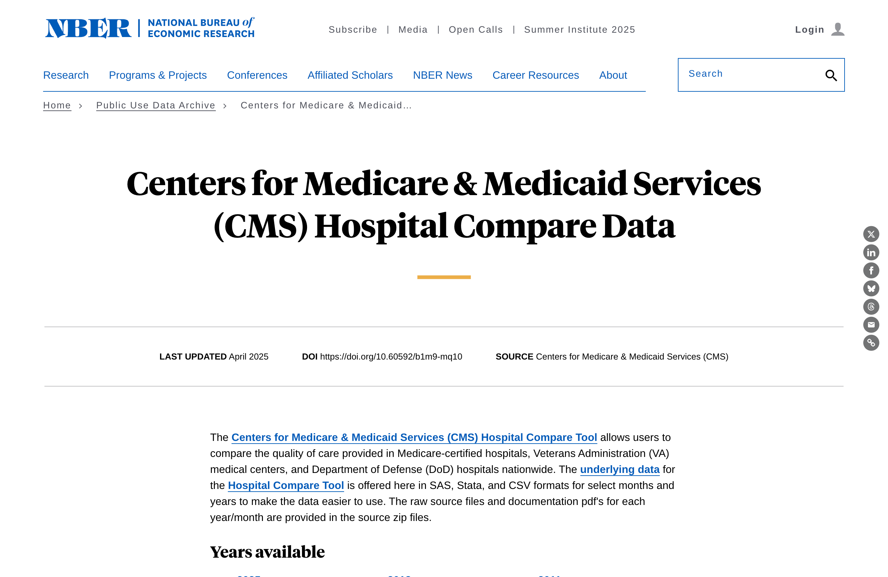
[*NBER data source page*](https://www.nber.org/research/data/centers-medicare-medicaid-services-cms-hospital-compare-data)

After analyzing the available data and settling on the specific sources to use, next I wanted to automate webscraping their site to pull the data into my project. Airflow would make that work perfectly. For my overall Docker multi-container project, I was using the templated provided by Astronomer as the base so the project automatically came with a PostgreSQL database. This was also perfect because I wanted more practice using Postgres and to combine that with dbt and Metabase would be rewarding.

The key challenge was writing the DAG script in Python to pull the webpage as a BeautifulSoup object, parse through it to find the .zip file link for 2025 (the NBER bundled all the files together which was nice), extract them and only pull the files I decided on using. I used Pandas to turn those extracted .csv files into dataframes, and then I could connect to my Postgres Docker container to save them as "raw__" tables. There was quite a bit of repeated steps here of course, so I wrote a function to use the Postgres connection engine and save the dataframe as a new raw table, as long as it was given the engine, dataframe, and table name to use. The upfront work here was plenty of trial and error, but needed to establish a strong foundation for modeling with dbt.

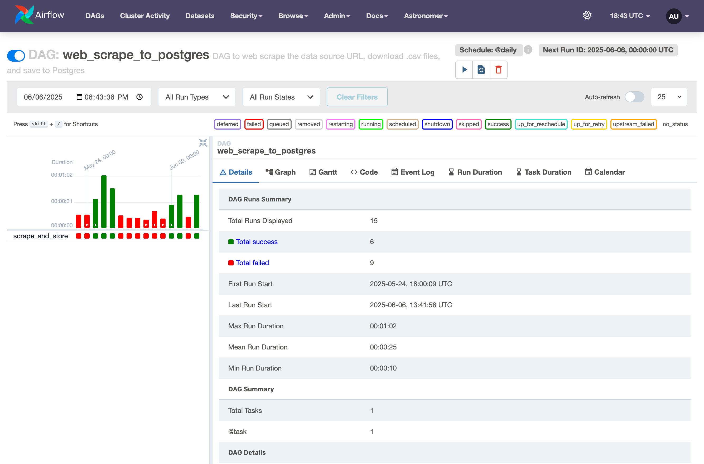
*Airflow UI view for the webscraping DAG*

Next up: start modeling with dbt! There were so many great challenges to work through in this part. First, I needed to figure out how to not only add my dbt project inside of the webserver container as part of this Astro project, but I needed to make sure this was added as a persistent volume. I will be honest and say that ChatGPT came to the rescue here - incredibly helpful. What was also interesting was figuring out that when I activated the bash shell to explore the webserver's container files, I did not realize I was actually inside the scheduler - so I also learned how to specify which container to jump into when activating the shell.

Once I was able to cd into my dbt project inside of the webserver container, I was ready to start modeling. Right away I knew I wanted to tackle the project using the traditional medallion layers: Bronze, Silver and Gold.
- Bronze would be for carrying in essentially the raw tables I pulled in with the webscraping DAG. These would be materialized as views to save database space.
- Silver was where I would ensure that data types were correct, make sure there were unique and not null values, as well as run other tests. These tables needed to be ready for combining into Gold level tables.
- Gold is for the reporting layer, and I settled on establishing one big table that contained the key information needed for Metabase. Not everything from Silver is included but only what I felt necessary.

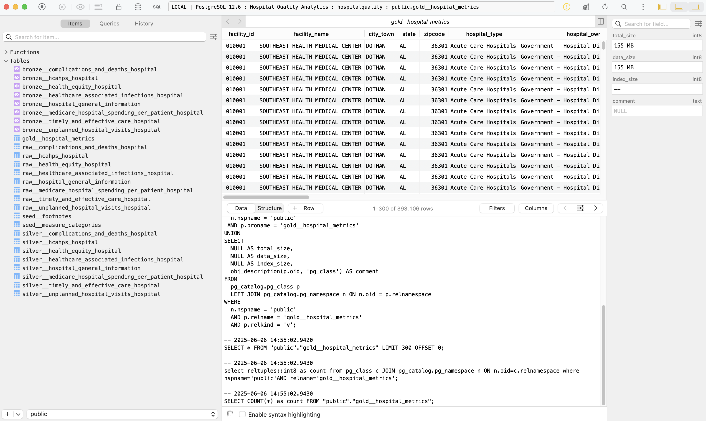
*View of the Postgres database in TablePlus*

Bronze was the most straightforward section as expected. These models were virtually (pun intended) the same as the raw tables. As far as naming conventions went, I liked adding the prefix "raw__" or "bronze__" and so on with the layer name and a couple of underscores after it.

Silver was a bit trickier than expected, only because although some of the tables had similar information in terms of content, their structures varied a bit; but I knew I could modify these to have them ready for combining into the Gold layer. I went through this part in phases - first I made sure that the data types were correct for each table and ensured consistency across tables. A couple of macros were created because I ran into a couple of repeated code situations, such as for adding null values were necessary and then for adding leading zeroes to the facility IDs when they were missing. Then I checked out the columns I wanted to hang onto for Gold, and if one was missing from a Silver table, it was added. This way I wouldn't run into issues when using union commands to tie them together.

The final Gold level table came together perfectly I'm happy to say, and keeps the executive level reporting simple and easy to grasp. I kept in only key hospital information such as state and zip (more could be added of course in a future iteration) but all of the important metric information was included here.

I should also mention that this project wasn't a clear cut and dry step by step - I had to jump around a bit as I figured out one part of the overall modeling, then realizing "oh I need to add this in order for this to happen" and then the entire project came together more cohesively. Here are a few examples:
- I realized at once point while working on Silver that I needed to use dbt seed files. These are files with static data, usually in .csv that you can import into your warehouse. Specifically I needed detailed information about the footnotes (since the tables only had IDs) and I also needed to make a custom metric category table as one didn't exist yet. It would only help out the reporting layer to be able to break down the metrics because first glance looking at those names, it wasn't obvious what they were measuring.
- To avoid too much typing at once, I decided to document the models as I worked through each layer. So once I got the Bronze tables in as needed, I added the corresponding .yml file as well as markdown files for each table's documentation. That worked great because it was a lot of detail to keep track of! And it was a good way to break up the process between writing SQL for each model and adding documentation in as much detail as possible.

To wrap up the dbt section, Airflow needed to be able to connect with my dbt project and run commands on the project. This way everything could be orchestrated and scheduled, not just webscraping NBER's site. I initially thought this was going to be difficult but it actually was quite simple. Essentially tell the DAG to cd into the webserver's container and then the dbt project, and then run `dbt run` and `dbt test`. Of course this can be changed to `dbt build` to include adding seed files as necessary.

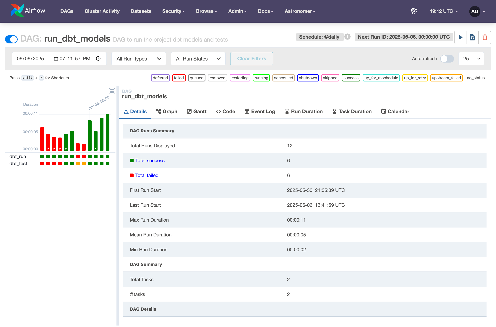
*Airflow UI view for the dbt DAG*

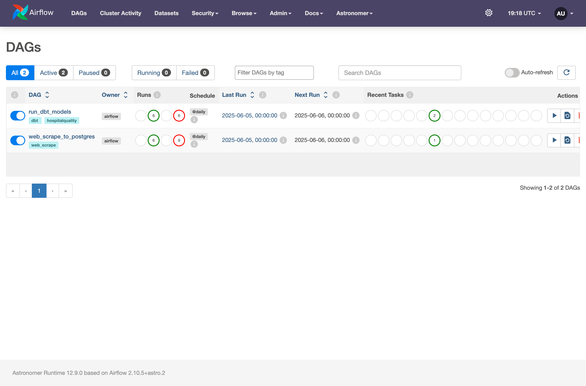
*Airflow UI for all DAGs in this project*

Last stop was building the executive dashboard with Metabase. This was my first time working with Metabase and I liked the challenge as I have experience with other BI tools such as Power BI and Google Looker Studio. After connecting to your warehouse, you can create visuals by asking questions or writing SQL queries, and then decide on the type of visual to use. It was straightforward, and I liked how easy it was to pull something together and make it look polished and professional! I wanted to keep this high level by looking at overall hospital quality ratings by state, by ownership type, and distribution of facilities with emergency services. The goal wasn't to answer every question, but to get the conversation going with an audience of high-level leaders in the industry.

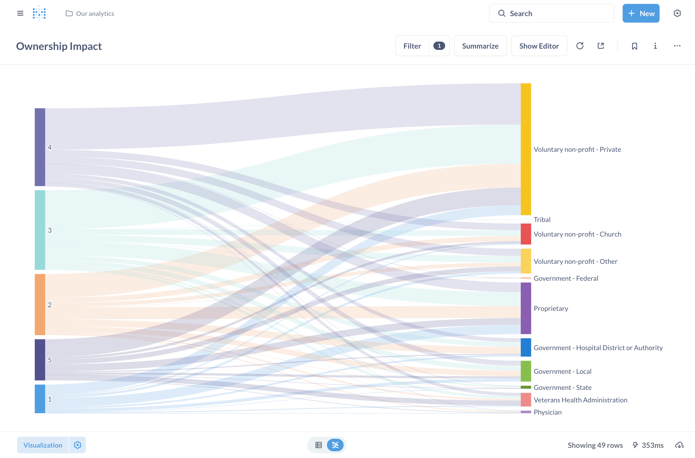
*Working on a Metabase visual*

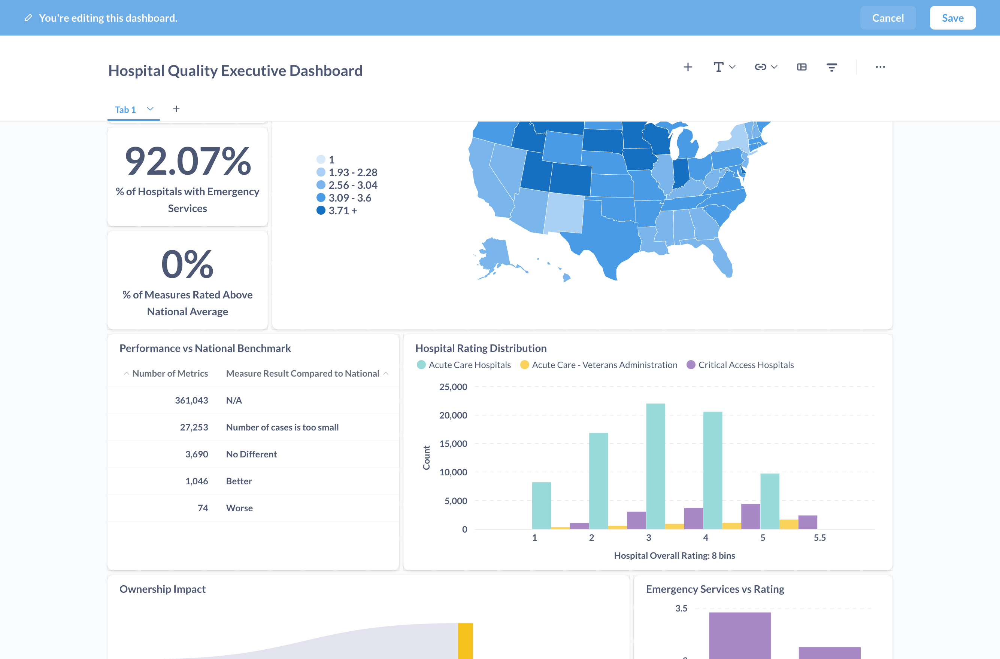
*Working on the Metabase dashboard*

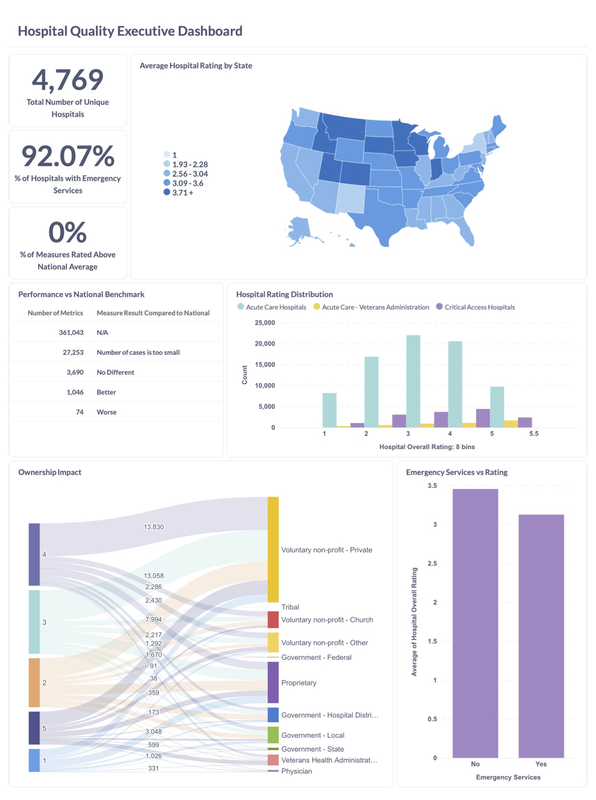
*Final Executive Dashboard*

With that the hospital quality analytics project was complete! However there was still one more step I wanted to explore and see if it was possible: could I deploy at least the Metabase Docker container I used to build the report? Could I share this publicly? While this part didn't pan out as I hoped, I still wanted to share this anyway because I'm thankful for the experience. I don't have a budget to pay for Docker deployments so I found an option I thought might work: Fly.io. Their service made it simple to install their CLI and get a Docker container app up and going in maybe 5-10 minutes. See the [Fly.io folder](./hospitalquality_fly/) I set up for this part. There is a Dockerfile and .toml file for Fly to use when uploading the database information, but unfortunately due to the free tier limits, I was not able to get Metabase working on their server in a sustainable way. I hoped to have an interactive dashboard to play with, but I provided a PDF export of the report. This was still a great learning opportunity and it was a win to have it deployed on their site, even though it was too slow to use.

From here, this multi-container Docker project could be deployed somewhere such as AWS, Azure or Google Cloud, and Airflow configured to run on a schedule, ideally when the NBER updates their data. I greatly enjoyed working on this project to explore the data behind providing quality care for the vulnerable population and figure out how to use Airflow to orchestrate everything from webscraping to `dbt run`, and finally use Metabase to build a report for leaders - all within Docker!

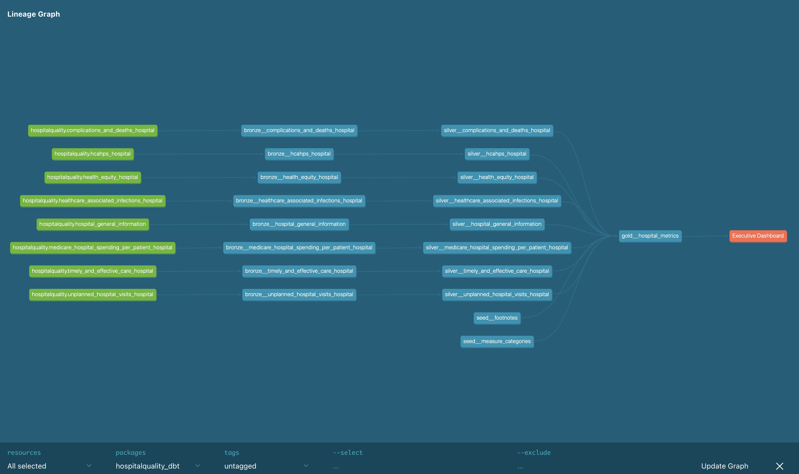
*Final dbt lineage graph*

Files included for view in this project:
- [`Hospital Quality Executive Dashboard.pdf`](./assets/Hospital%20Quality%20Executive%20Dashboard.pdf): Executive Dashboard
- [`Complete Docker project folder`](./hospitalquality_docker/)
- [`dbt project folder`](./hospitalquality_docker/dbt/hospitalquality_dbt/)

## By the Numbers

- < 1 month of development time
- 0 colleagues collaborated with
- 1 report page
- 1 data source
- 1 query connected to data source

## Tools Used

- Docker
- Airflow
- dbt (specifically dbt Core)
- Metabase
- TablePlus (app for viewing my Postgres database)
- LucidChart (for Gold-level schema)
- Pinata Cloud (for hosting a static PDF of my Metabase dashboard)

## Data Engineering Pipeline

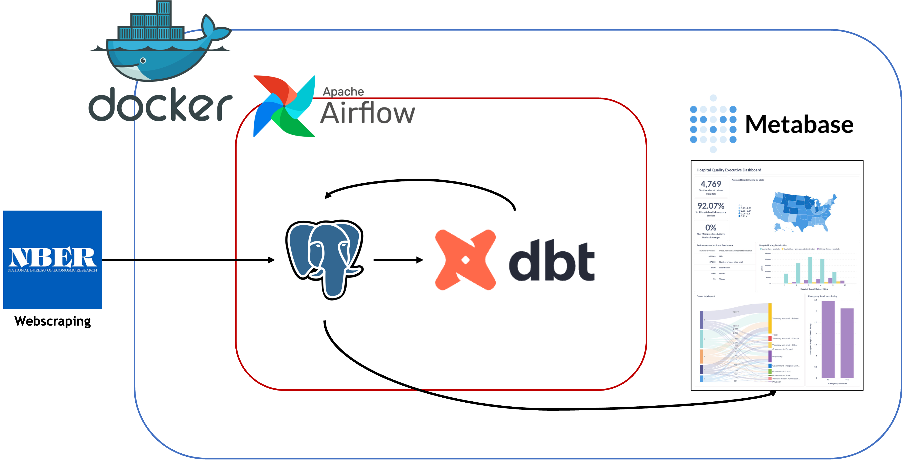

## Data Model

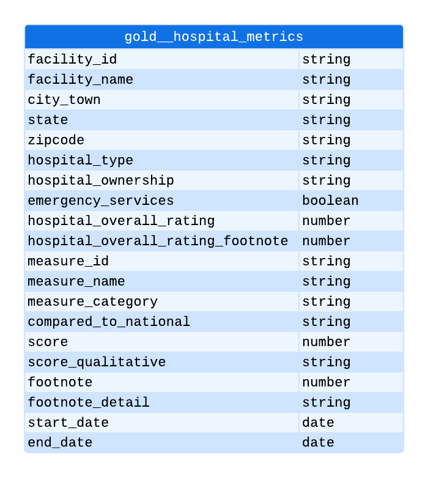

## Useful Resources

- [NBER data source page](https://www.nber.org/research/data/centers-medicare-medicaid-services-cms-hospital-compare-data)