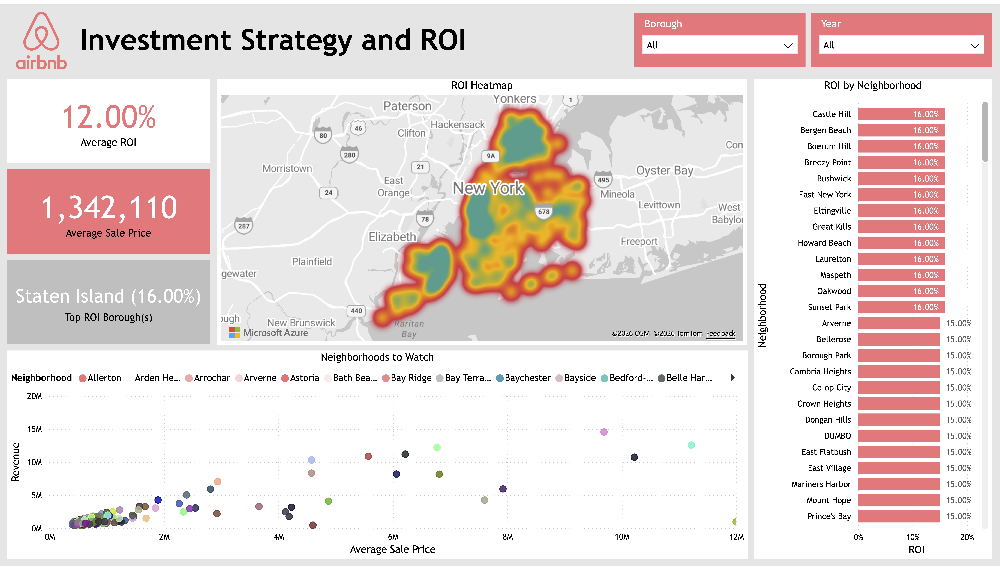
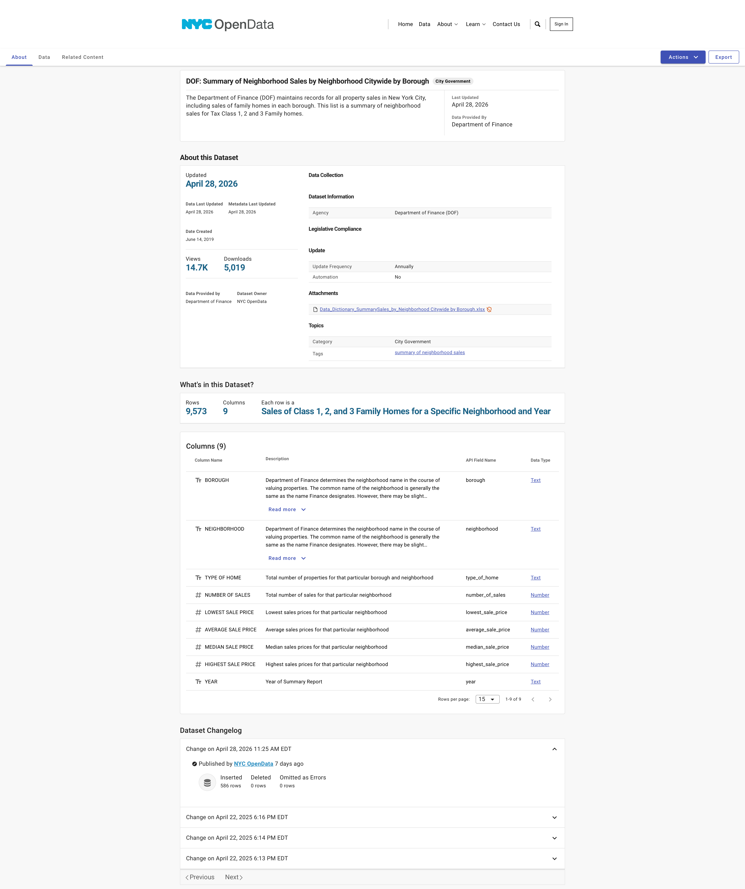
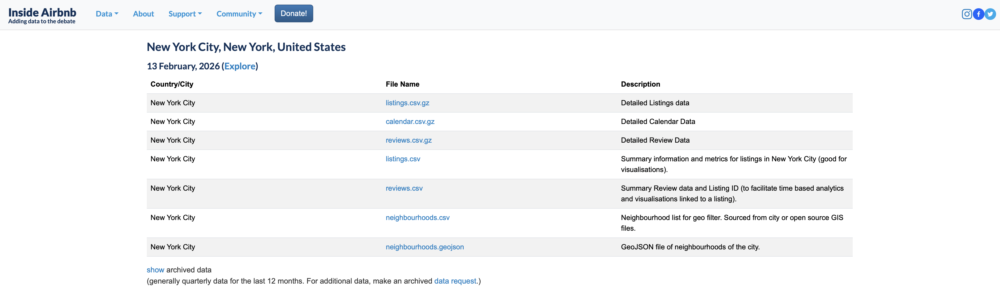
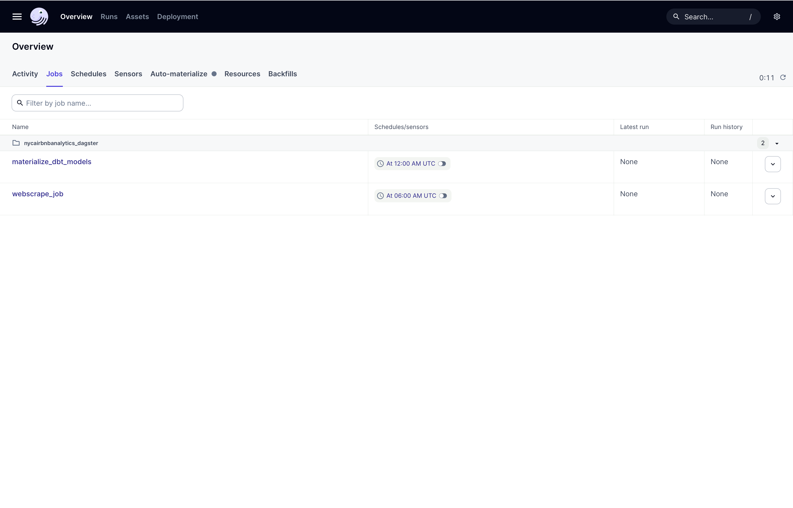
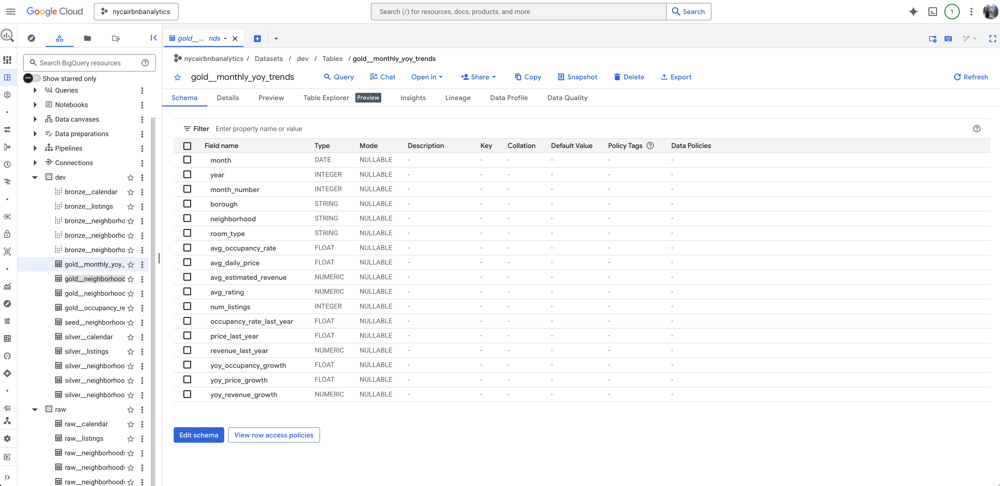
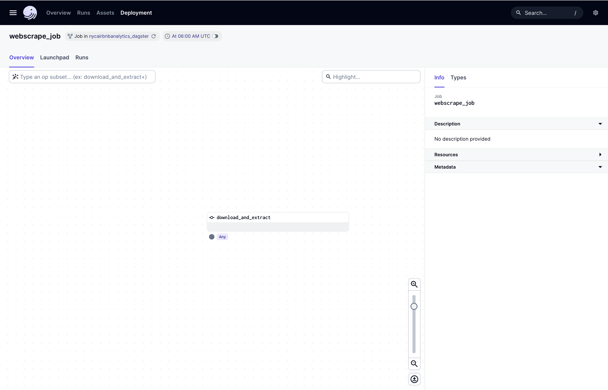
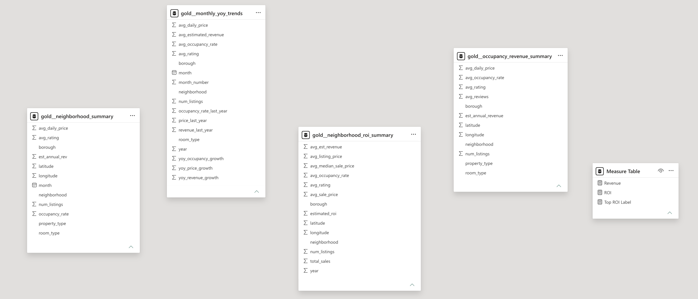
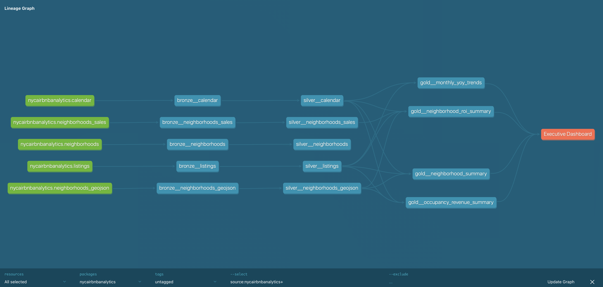
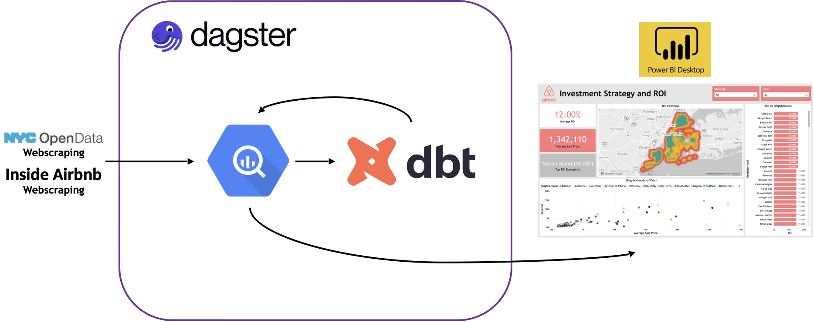
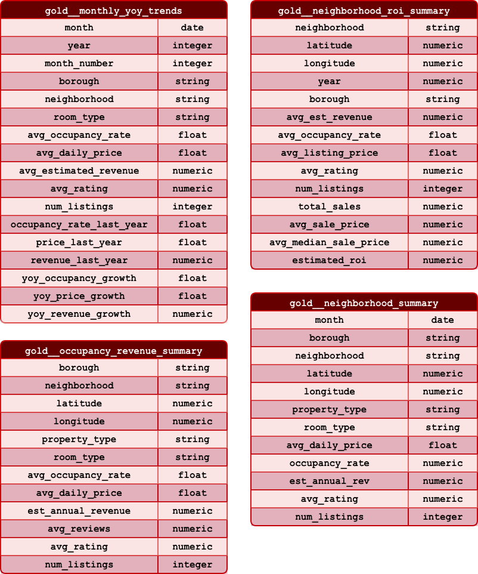

# NYC Properties and Airbnb Analytics

 

Having family in New York City and been to visit several times, you can’t help but hear the constant chatter regarding the real estate market and the massive influence of short-term rentals. I realized this was the perfect place to explore for my next project. I wanted to move beyond the headlines and dive into the actual intersection of residential property sales and Airbnb activity. What does the density of rentals look like across the boroughs? Are there clear correlations between property values and rental availability? How is the "sharing economy" actually shaping the landscape of NYC neighborhoods?

This project gave me a fantastic opportunity to sharpen my analytics engineering skills by using Dagster to orchestrate a multi-source pipeline—combining API calls with custom web-scraping—and transforming that raw data with dbt in Google BigQuery. Visualizing the final insights in Microsoft Power BI allowed me to bridge the gap between complex data movement and actionable executive reporting. I learned a ton about the nuances of urban data with this build!

### [Live Demo](https://app.fabric.microsoft.com/view?r=eyJrIjoiNzA0YWI3MWQtNjliZi00ZWEzLTlhZTktYmI5ODE3YjNiYjQwIiwidCI6ImY3N2E4MGM5LTY5MTAtNGJkYy1iNjFiLTgxNzA2NmQ1NmI0NiIsImMiOjJ9)
### [dbt Documentation](https://dbt-nyc-properties-gdbecker.netlify.app/#!/overview)

## Project Details
- [NYC Properties and Airbnb Analytics](#nyc-properties-and-airbnb-analytics)
    - [Live Demo](#live-demo)
    - [dbt Documentation](#dbt-documentation)
  - [Project Details](#project-details)
  - [Details](#details)
  - [By the Numbers](#by-the-numbers)
  - [Tools Used](#tools-used)
  - [Data Engineering Pipeline](#data-engineering-pipeline)
  - [Data Model](#data-model)
  - [Useful Resources](#useful-resources)

## Details

I’ve had the chance to work across various platforms like Microsoft Fabric and Snowflake, but for this project, I wanted to lean back into the Google Cloud / BigQuery ecosystem to really refine my serverless data warehousing workflows. Given the scale of NYC property records, BigQuery’s speed and integration with dbt felt like the right choice for a high-performance analytics project.

Before I touched a single line of SQL, I spent time exploring NYC Open Data and Inside Airbnb to understand the "shapes" of the datasets. NYC Open Data is an incredible resource for public transparency, offering deep dives into housing and environment metrics directly from city agencies. On the other hand, Inside Airbnb provides a vital community-driven perspective on how short-term rentals impact our neighborhoods. Combining these two—the official city records with the "on-the-ground" rental reality—was the key to unlocking a 360-degree view of the NYC property market.

[*NYC Open Data page*](https://opendata.cityofnewyork.us)

The first leg of the journey involved the NYC Open Data Portal. This platform is a goldmine for anyone looking to understand city operations, but it requires a bit of finesse to handle pulling data the best way. By default, you can export tables into a .csv format, but once I found their API endpoint, I knew using the JSON format was the best way to go for scalability and practice. Using Python within Dagster, I focused on extracting property sales data and neighborhood boundaries. The documentation was clear, but the challenge was ensuring I was hitting the right endpoint to get the most recent housing safety and valuation records. Automating this via API calls made it easy to gather a rich, structured dataset without the manual overhead of downloading static files.

[*Inside Airbnb page*](https://insideairbnb.com/get-the-data/)

The second data source, Inside Airbnb, required a different approach. Since they provide quarterly updates for cities worldwide, I needed a way to programmatically grab the most relevant NYC files. This is where I got to practice some web-scraping using BeautifulSoup. I wrote a custom Python script to navigate the Inside Airbnb site, identify the latest listings and neighborhood data, and extract the necessary CSV links. It was a great exercise in handling unstructured web data and converting it into a clean format ready for the BigQuery ingest.

*Dagster UI view for the API calls and dbt DAG*

With the data sources identified, it was time to build the "brain" of the pipeline: the Dagster orchestrator. I’ve used Airflow in the past, but Dagster’s asset-based approach is much more intuitive for modern dbt workflows. I set up the initial DAG to handle the web-scraping and API calls, ensuring the data landed in BigQuery before the dbt transformations kicked off.

I believe one of the best ways to learn is to dig in and practice, and using Dagster for this project provided all that and more. The biggest hurdle was parsing through the .geojson data that was provided from web-scraping Inside Airbnb. One of the files scraped was titled `neighbourhoods.geojson` and it was deceptively tough working through the data in this file to save in the right format for the BigQuery tables, including latitude, longitude, and geometry shape data. It felt very accomplishing and rewarding grabbing the data correctly to load into the `raw` source tables.

*Overview of the schema structure in Google BigQuery*

I followed the Medallion architecture to keep the logic clean and scalable:

- Bronze: This layer acted as a mirror for the raw API and scraped data. I kept these as views to save on storage and prefixed them with `bronze__` to maintain clear lineage.
- Silver: Things got a bit more technical here. I focused on cleaning up the messy neighborhood names from the web-scraping and ensuring property sales prices were cast to the right numeric types. This layer was all about consistency and preparing the data for the heavy-duty joins.
- Gold: This is the reporting layer. I synthesized the properties and rental data into a set of four `gold__` level tables. I didn't need every single column from the previous layers—only the core metrics like ROI estimates, rental density, and property value trends that would drive the Power BI visuals.

Working through this in dbt was a cycle of `dbt run` and `dbt test`. It was incredibly satisfying to watch the Dagster UI green up as the data flowed from a Python-scraped website all the way into a polished Gold-level reporting table.

*Dagster UI view for the first DAG: web-scraping and pulling JSON data*

*Dagster UI view for the second DAG: dbt models*

The final stop was Microsoft Power BI. I wanted to create a two-page executive dashboard that would allow a user to toggle between a high-level borough overview and a granular neighborhood deep dive. Connecting Power BI to BigQuery was seamless, allowing me to build an interactive experience where slicers could filter both Airbnb density and property sales simultaneously. The goal was to make it easy for someone to spot "hot" neighborhoods where rental demand might be outpacing property supply. Seeing the data come to life in a map-based visual really tied the whole "NYC" theme together.

*Power BI semantic model view of Gold level tables*

*Final executive dashboard from Power BI*

With the dashboard live, the project felt complete! To ensure this build stayed accessible, I published the dbt documentation to Netlify so anyone could explore the lineage and logic behind the transformations. I also made sure to include a PDF version of the dashboard for quick viewing.

I truly enjoyed the challenge of blending two very different data sources—official city records and community-scraped data—to solve a real-world curiosity. It gave me a lot more confidence in using Dagster as a full-scale orchestrator and dbt as the engine for complex urban analytics. This pipeline is scalable, robust, and ready to handle even more NYC data as it's released.

*Final dbt lineage graph*

Files included for view in this project:
- [`NYC Properties and Airbnb Analytics Executive Dashboard.pdf`](./assets/NYC_Properties_and_Airbnb_Analytics_Executive_Dashboard.pdf)
- [`dbt project folder`](./nycairbnbanalytics/)
- [`Dagster project folder`](./nycairbnbanalytics_dagster/)

## By the Numbers

- 1 month of development time
- 2 report pages
- 2 data sources
- 4 queries connected to data sources

## Tools Used

- BigQuery
- Dagster
- dbt (specifically dbt Core)
- Microsoft Power BI

## Data Engineering Pipeline

## Data Model

## Useful Resources

- [Guide for webscraping with Python and Beautiful Soup](https://www.geeksforgeeks.org/python/implementing-web-scraping-python-beautiful-soup/)