# NYC Filming and IMDb Analytics

 

If you’ve ever walked through the streets of New York City and tripped over a stray power cable or been rerouted by a "No Parking: Film Shoot" sign, you know that NYC is essentially one giant, living movie set. After finishing my property and rental analysis, I found myself wondering: how does this massive influx of production actually map out across the city? Which neighborhoods are the true stars of the silver screen, and how do those filming locations correlate with the critical acclaim or popularity of the titles themselves?

This project gave me the perfect opportunity to push my technical boundaries by orchestrating a hybrid data stack. I navigated the complexities of Microsoft Fabric, used Dagster to trigger remote cloud pipelines, and transformed millions of rows of IMDb metadata alongside city filming permits using dbt Core. It was a challenging but rewarding journey into the world of entertainment analytics and enterprise-grade orchestration!

### [Live Demo](https://app.fabric.microsoft.com/view?r=eyJrIjoiZGUxYTdkM2ItMDEzOC00MTlhLWFiOTgtMGUxM2M4NWY5YTVjIiwidCI6ImY3N2E4MGM5LTY5MTAtNGJkYy1iNjFiLTgxNzA2NmQ1NmI0NiIsImMiOjJ9)
### [dbt Documentation](https://dbt-nyc-filming-gdbecker.netlify.app/#!/overview)

## Project Details
- [NYC Filming and IMDb Analytics](#nyc-filming-and-imdb-analytics)
    - [Live Demo](#live-demo)
    - [dbt Documentation](#dbt-documentation)
  - [Project Details](#project-details)
  - [Details](#details)
  - [By the Numbers](#by-the-numbers)
  - [Tools Used](#tools-used)
  - [Data Engineering Pipeline](#data-engineering-pipeline)
  - [Data Model](#data-model)
  - [Useful Resources](#useful-resources)

## Details

For this build, I wanted to move beyond my comfort zone in BigQuery and Snowflake to tackle a more modern, unified analytics stack. I settled on a unique combination: Microsoft Fabric for the heavy-duty data warehousing, dbt for the modeling logic, and Dagster as the external orchestrator. The goal was to see if I could effectively manage an end-to-end lifecycle—from raw ingestion to executive reporting—within the Fabric ecosystem while maintaining the fine-grained control that Dagster provides.

The project relies on two distinct data components. First, I tapped into the NYC Open Data Portal to get the hard facts: where, when, and what was officially permitted to film in the five boroughs. Second, I integrated the IMDb Non-Commercial Datasets to provide the cultural context—ratings, genres, and title metadata. Bringing these two together allowed me to ask questions like: "Do high-rated dramas prefer Brooklyn, or are they sticking to the iconic backdrop of Manhattan?"

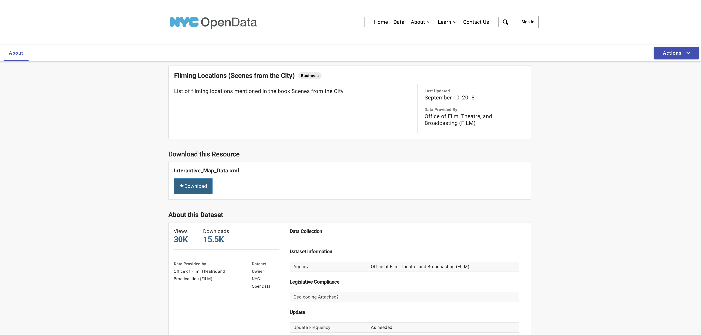
[*NYC Open Data page*](https://opendata.cityofnewyork.us)

The foundation of the spatial data came from the NYC Open Data Portal, specifically the "Filming Locations (Scenes from the City)" dataset. While the portal offers direct downloads, I wanted to build this for scalability, so I pulled the data directly from their site without handling a separate file. Using a Gen2 dataflow within Fabric, I was able to query the records in XML format, which allowed for a much cleaner ingestion into my Fabric environment. The XML format was tricky at first to work with but spending the time to navigate the tree was crucial for success. The challenge here wasn't just grabbing the data, but understanding the categories—distinguishing between a small indie documentary and a massive "Television Series" production that shuts down three blocks in Astoria.

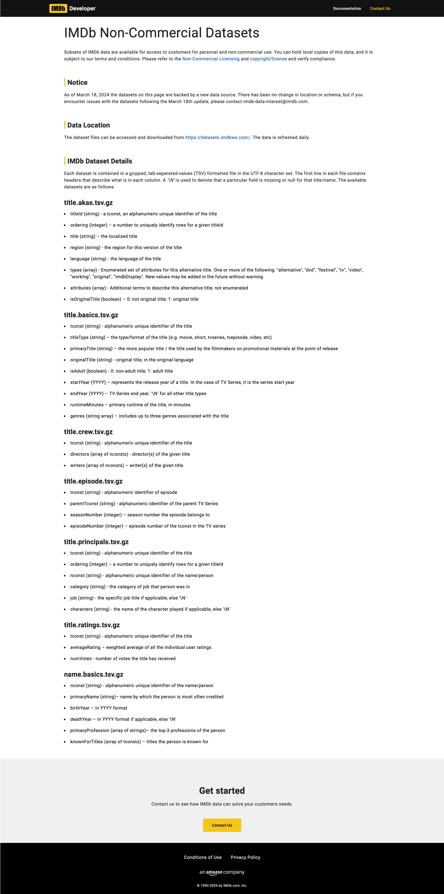
[*IMDb Non-Commercial Datasets*](https://developer.imdb.com/non-commercial-datasets/)

To add depth to the city’s permit data, I pulled in the IMDb Non-Commercial Datasets. Unlike a standard API, IMDb provides their data as compressed `.tsv.gz` files that are updated daily. These files are massive—covering millions of titles and cast members. I had to be strategic about which files to pull (focusing on `name.basics`, `title.basics` and `title.ratings`) to ensure I wasn't overloading my pipeline with unnecessary metadata. This was a great exercise in handling large-scale, standardized industry data and preparing it for a high-performance join with my city-level records.

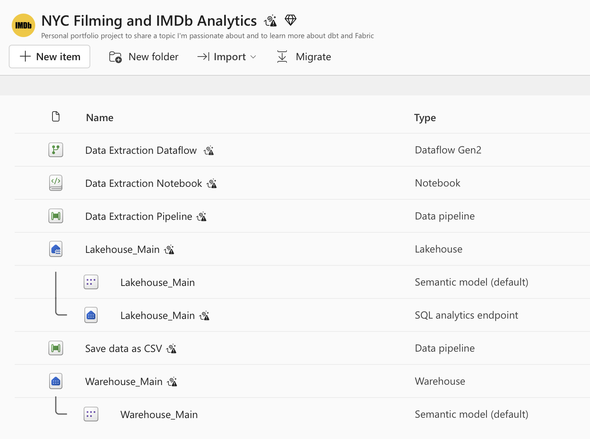
*Microsoft Fabric workspace view for all project items*

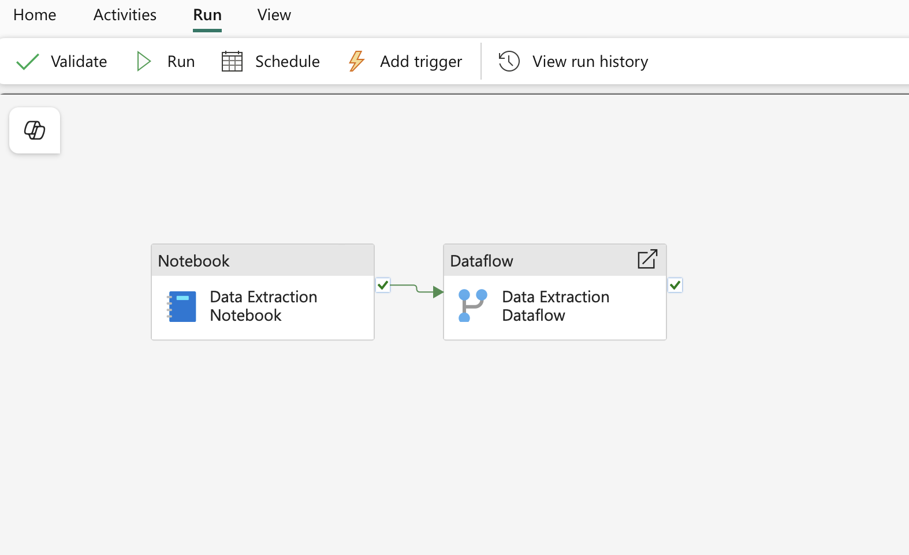
*Data Extraction Pipeline overview in Fabric*

Setting up the extraction was where the real experimentation began. I quickly discovered a hurdle: Dagster couldn't natively interact with and control specific Fabric items directly as easily as it does with local scripts. To solve this, I built a robust Data Extraction Pipeline directly within Microsoft Fabric. This consisted of a Python Notebook (.ipynb) for the initial API calls and file downloads, followed by a Dataflow Gen2 to move that processed data into the main Warehouse.

To bridge the gap between my local orchestration and the cloud, I used a workaround that involved the Fabric REST API. I wrote a custom Dagster operation that authenticates via a Service Principal, triggers the Fabric pipeline, and then "polls" the Fabric API every 30 seconds to check for completion. This ensured that Dagster remained the brains of the operation for the entire project, even though the heavy lifting was happening in the Fabric cloud.

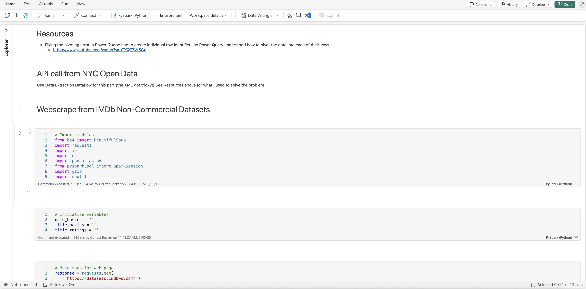
*Data Extraction Notebook .ipynb in Fabric*

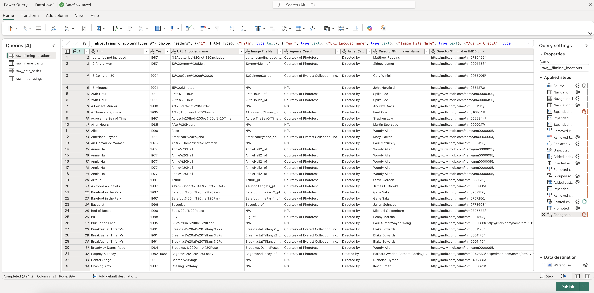
*Data Extraction Dataflow Gen2 view in Fabric*

This project involved a significant amount of trial and error documentation. If you look at my run history, you'll see a long list of failed attempts before I found the stable path. Handling service principal authentication for the Fabric API was a learning curve, as was managing the timeout logic for long-running notebook jobs. There were moments where the Fabric pipeline would succeed but the Dagster "poller" would lose the connection. Refining this logic helped me practice a lot of perseverance and gave me a much deeper understanding of how modern cloud platforms handle asynchronous jobs.

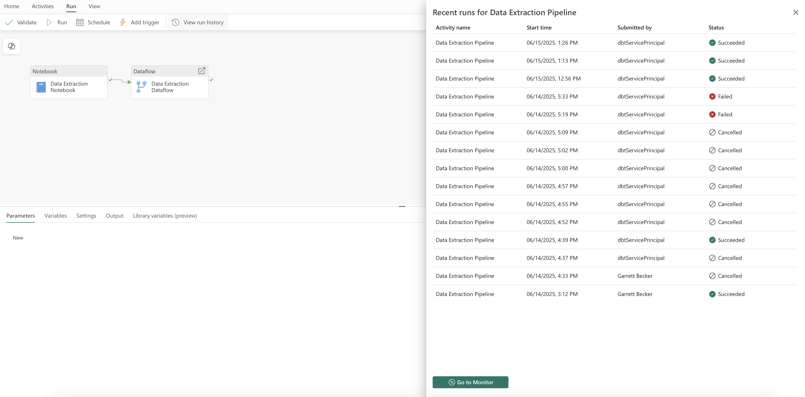
*Data Extraction Pipeline overview - with run history*

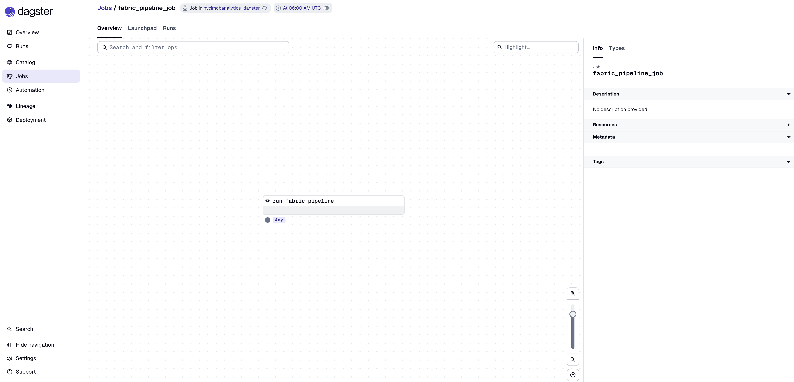
*Dagster UI view for the first DAG: running the Data Extraction Pipeline from Fabric*

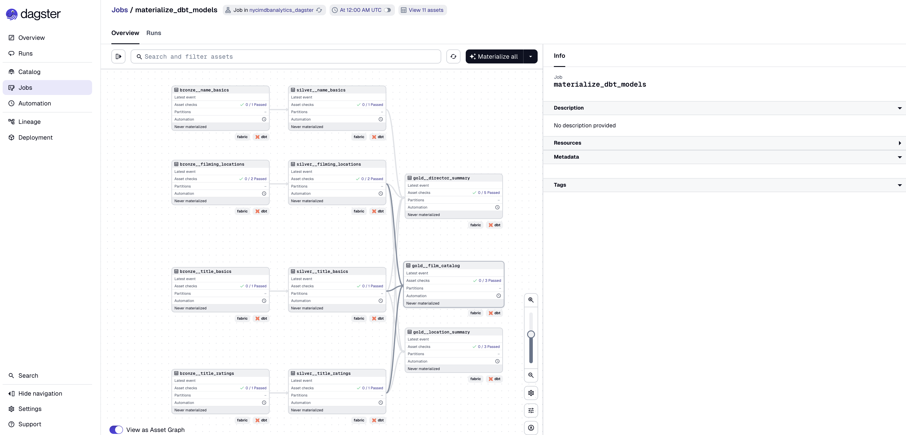
*Dagster UI view for the second DAG: materializing all dbt models*

Once the Fabric-to-Dagster handshake was stable, I organized the project into two distinct DAG components. The first triggers the remote Fabric extraction, and the second materializes the dbt models once the data is safely in the warehouse.

I stuck to the Medallion Architecture to ensure the data remained clean and traceable:
- Bronze: I mirrored the raw IMDb and NYC permit data as views. This layer is noisy and unrefined, serving as the historical record.
- Silver: This is where the heavy lifting happened. I standardized the title names, filtered the IMDb data to match the timeframes of our NYC filming locations, and handled null values in the filming locations.
- Gold: The final layer. I synthesized these into three core tables optimized for Power BI. This is where I calculated the the metrics that actually tell the story of NYC cinema.

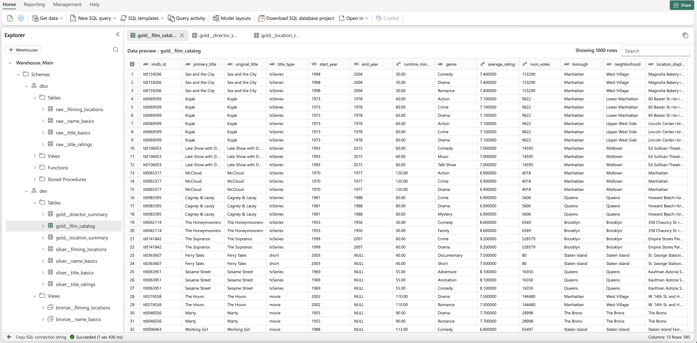
*Overview of the schema structure in my Fabric Warehouse*

The "Showreel" of the project is the two-page Power BI executive dashboard. I designed a custom-themed interface to mimic the cinematic feel of IMDb. The first page focuses on high-level film catalog and performance data, showcasing filming trends and quality vs. popularity. The second page dives into geography analysis, allowing users to filter by borough, neighborhood, or genre. I made sure every visual, from the borough heatmaps to the genre breakdown, was designed to help an executive quickly understand which areas of the city bring the most heat for high-impact productions.

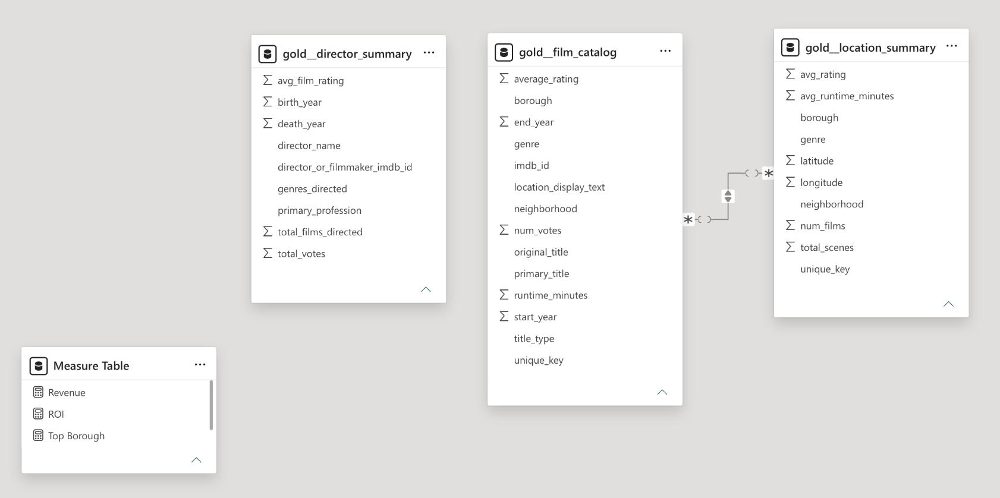
*Power BI semantic model view of Gold level tables*

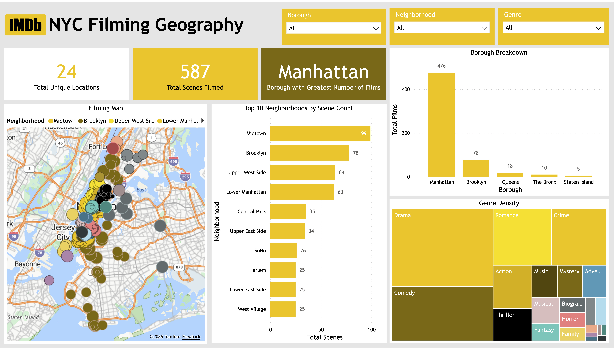
*Final executive dashboard from Power BI*

Looking back, this project was a major milestone in my development as an analytics engineer. Navigating the intricacies of a platform like Microsoft Fabric and successfully connecting it to an external orchestrator like Dagster was a significant challenge. By publishing the dbt documentation to Netlify and providing a full PDF of the dashboard, I’ve tried to make the entire logic of the "Film to Fabric" pipeline as transparent as possible.

This project gave me newfound confidence in building hybrid cloud architectures. It's one thing to run a local script; it's another thing entirely to manage a multi-tool pipeline that communicates across different cloud environments to turn raw city data into cinematic insights.

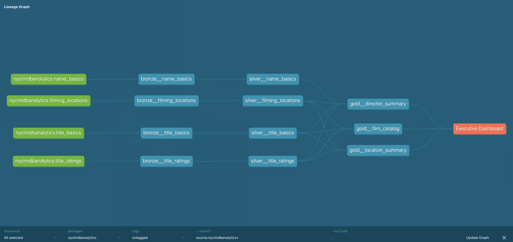
*Final dbt lineage graph*

As a final mission, I took the opportunity to explore Fabric Lakehouses. While my main pipeline focused on the Warehouse for its SQL-first dbt compatibility, I built an additional pipeline to archive my final gold-level datasets into a Lakehouse as .csv files. This gave me hands-on experience with the medallion Lakehouse concept and showed me how to ensure data portability—meaning I now "own" a static version of the transformed data that can be used even if I move outside of the Fabric ecosystem. It was a great way to round out my Fabric capabilities!

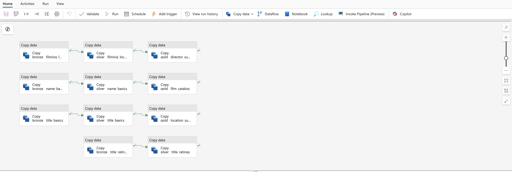
*Save Data as CSV Pipeline overview in Fabric*

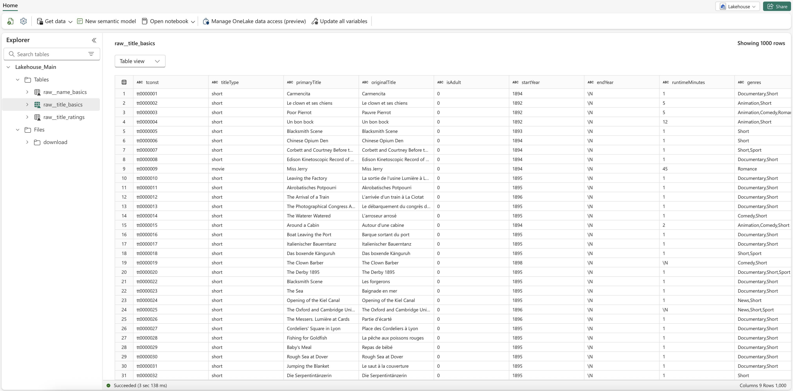
*Overview of the Lakehouse in Fabric*

Files included for view in this project:
- [`NYC Filming and IMDb Analytics Executive Dashboard.pdf`](./assets/NYC%20Filming%20and%20IMDb%20Analytics%20Executive%20Dashboard.pdf)
- [`dbt project folder`](./nycimdbanalytics/)
- [`Dagster project folder`](./nycimdbanalytics_dagster/)

## By the Numbers

- 1 month of development time
- 2 report pages
- 2 data sources
- 3 queries connected to data sources

## Tools Used

- Microsoft Fabric (notebooks, dataflows, pipelines, warehouses and lakehouses)
- Dagster
- dbt (specifically dbt Core)
- Microsoft Power BI

## Data Engineering Pipeline

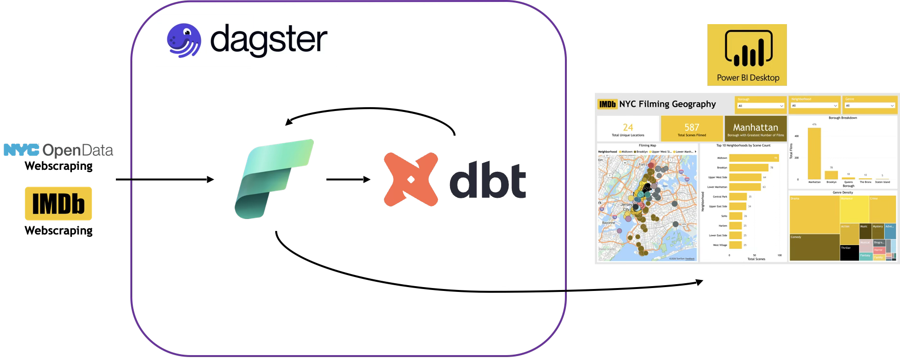

## Data Model

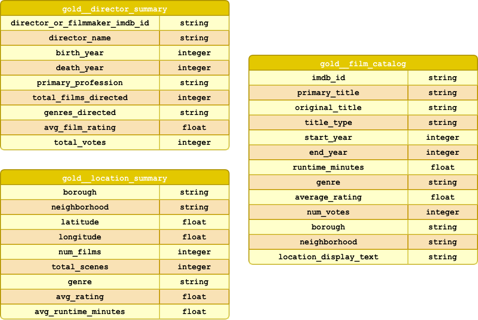

## Useful Resources

- [REST API capabilities for pipelines in Fabric Data Factory - Article from Microsoft](https://learn.microsoft.com/en-us/fabric/data-factory/pipeline-rest-api-capabilities)